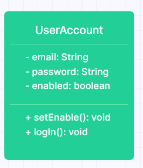

## User account domain model
| Class       | Field           | Methods                      | Scenarios | Outcome       |
|-------------|-----------------|------------------------------|-----------|---------------|
| UserAccount | String email    |                              |           |               |
|             | String password |                              |           |               |
|             | boolean enabled |                              |           |               |
|             |                 | setEmail(String mail)        |           | print message |
|             |                 | getMail()                    |           |               |
|             |                 | setPassword(String password) |           | print message |
|             |                 | setEnable()                  |           |               |
|             |                 | logIn()                      |           | print message |
